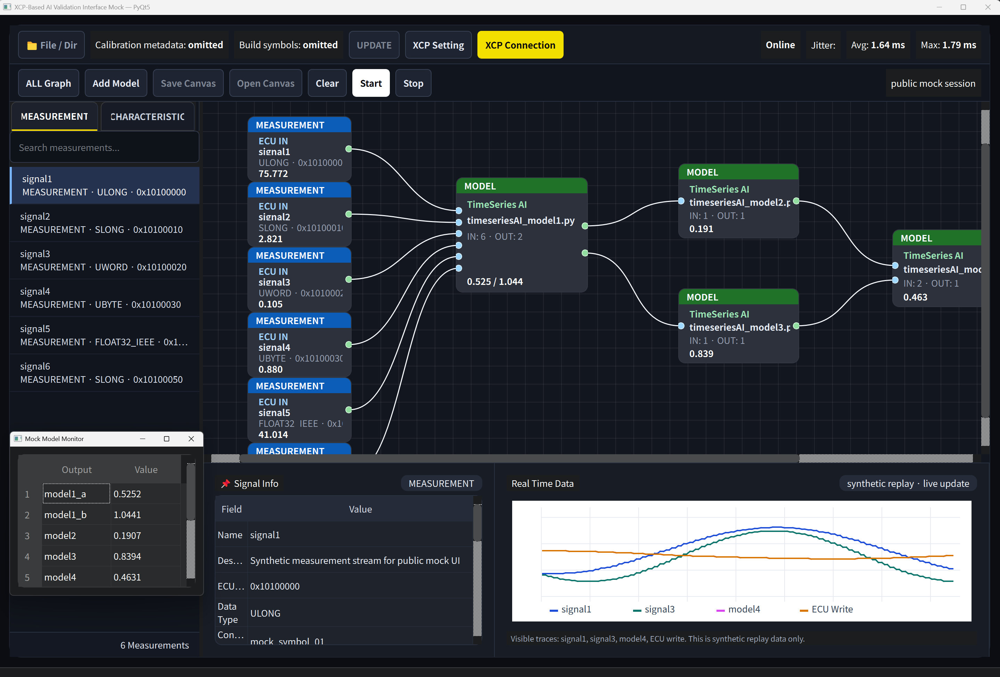

# Real-Time Vehicle AI Validation Studio

> [!NOTE]
> This repository is a **public-safe portfolio mock**.  
> It does **not** contain proprietary company code, real ECU data, production A2L/ELF files, internal model assets, or confidential validation logic.  
> All signals, addresses, replay values, model files, and backend data paths are synthetic.

A transport-adaptable **PyQt5 + C++ vehicle AI validation studio mock** for real-time vehicle signal replay, AI model block validation, and data-flow visualization.

This project demonstrates a public-facing version of a vehicle AI validation workflow originally designed under constrained hardware conditions. The available communication path was CAN-FD/XCP-style access, but the backend was intentionally separated behind a transport abstraction layer so that future Ethernet-based interfaces can be integrated without redesigning the UI, signal workflow, or model validation canvas.

---

## Repository Description

**Public-safe portfolio version of a transport-adaptable real-time vehicle AI validation studio using synthetic A2L, ELF, replay, and model data.**

---

## Demo

### Working Demo


### Main Interface



Expected media structure:

```text
docs/
└── media/
    ├── demo.gif
    └── screenshot_main.png
```

If the images do not appear on GitHub, check that the actual file names and README paths match exactly.

---

## Why This Project Exists

Vehicle AI validation workflows often depend on specific hardware, ECU interfaces, calibration files, and internal toolchains. In the original engineering context, the available hardware path was limited, so the system was designed to extract the maximum practical value from the available interface while keeping the software architecture expandable.

The key design decision was to separate the GUI and validation workflow from the transport backend.

Instead of hard-coding the application around one interface type, the project uses a backend abstraction layer:

```text
_backend/
├── mock backend
├── CAN-FD / XCP-style adapter concept
└── future Ethernet adapter extension point
```

This allows the same UI and model workflow to support different transport implementations later, including Ethernet-based measurement or calibration interfaces.

---

## Core Features

### Simulink-like Validation Canvas

- Drag/drop signals from the A2L signal list.
- Add model blocks.
- Move blocks freely.
- Select blocks individually.
- Ctrl-click to multi-select blocks.
- Rubber-band selection by dragging an area.
- Delete selected blocks with `Delete` or `Backspace`.
- Middle-mouse panning, similar to Simulink-style navigation.
- Click-to-connect port wiring.
- Cancel pending connection with `Esc` or right-click.

### Dynamic Model Blocks

Double-click a model block to open the configuration dialog:

- Select `.py` script or `.onnx` model file.
- Set input count.
- Set output count.
- The block graphically updates its input/output ports.
- Existing invalid connections are pruned when port count is reduced.

### Independent Port Connections

Each model input/output has its own graphical port. Each connection stores:

```text
source block
source port index
destination block
destination port index
data key
```

### Real-Time Data-Flow Visualization

During replay:

- Active connection lines turn white.
- Inactive connection lines remain green.
- Selected inactive lines are highlighted.
- Double-clicking a line opens a floating pyqtgraph window for real-time data-flow monitoring.

### Floating Graph Windows with pyqtgraph

The **ALL Graph** button opens floating real-time graphs for:

- DAQ / measurement signals
- model output values
- ECU write value
- jitter / replay timing metrics

### Mock A2L and ELF Integration

The project includes public-safe mock metadata:

- synthetic A2L signal definitions
- synthetic ELF symbol map
- synthetic signal addresses
- synthetic measurement and characteristic data

No real ECU calibration metadata is included.

### C++ Mock Backend

The repository includes a buildable C++ mock backend to demonstrate embedded/backend implementation capability. The C++ code is intentionally mock-only and does not communicate with real hardware.

---

## Tech Stack

| Area | Technology |
|---|---|
| GUI | PyQt5 |
| Real-time plotting | pyqtgraph |
| Backend mock | Python async worker |
| C++ backend mock | C++17 |
| Build system | CMake |
| Data files | Synthetic A2L, ELF, CSV-style replay |
| Architecture pattern | Transport-adaptable backend abstraction |
| Purpose | Public-safe portfolio demo |

---

## Project Structure

```text
realtime-vehicle-ai-validation-studio/
├── main.py
├── requirements.txt
├── README.md
├── _uiux/
├── _backend/
│   ├── mock_assets/
│   └── cpp/
├── _utility/
├── tests/
└── docs/
    └── media/
        ├── demo.gif
        └── screenshot_main.png
```

---

## Installation

```bash
git clone https://github.com/<your-github-id>/realtime-vehicle-ai-validation-studio.git
cd realtime-vehicle-ai-validation-studio
python -m venv .venv
.venv\Scripts\activate
pip install -r requirements.txt
```

---

## Running the Application

```bash
python main.py
```

If Qt style rendering behaves differently on a local Windows machine, the stylesheet can be disabled for debugging:

```cmd
set E2E_MOCK_DISABLE_QSS=1
python main.py
```

---

## Building the C++ Mock Backend

```bash
cd _backend/cpp
cmake -S . -B build
cmake --build build
```

The Python GUI does not require the C++ executable to run. The C++ mock exists to demonstrate backend structure and C++ implementation capability.

---

## Usage Guide

### Add a measurement block

1. Select the **MEASUREMENT** tab.
2. Drag a signal into the canvas.
3. The signal appears as a block with metadata from the mock A2L file.

### Add a characteristic block

1. Select the **CHARACTERISTIC** tab.
2. Drag a characteristic item into the canvas.
3. The block appears as a mock ECU write/output target.

### Add a model block

1. Click **Add Model**.
2. An empty model block appears on the canvas.
3. Double-click the model block.
4. Select a `.py` or `.onnx` file.
5. Set input/output counts.
6. Confirm the configuration.

### Connect blocks

1. Click a source output port.
2. Move the mouse to a destination input port.
3. Click the destination port.
4. A connection line is created.

Cancel connection:

- Press `Esc`, or
- Right-click the canvas.

---

## Architecture Overview

```text
+----------------------------------------------------------+
| PyQt5 Frontend                                           |
| - signal list                                            |
| - validation canvas                                      |
| - model configuration dialog                             |
| - pyqtgraph monitors                                     |
+--------------------------+-------------------------------+
                           |
                           v
+----------------------------------------------------------+
| Backend Interface / Transport Abstraction                |
| - mock backend                                           |
| - CAN-FD/XCP-style adapter concept                       |
| - future Ethernet adapter extension point                |
+--------------------------+-------------------------------+
                           |
                           v
+----------------------------------------------------------+
| Mock Data / Metadata Layer                               |
| - synthetic A2L                                          |
| - synthetic ELF symbols                                  |
| - synthetic replay data                                  |
| - placeholder model files                                |
+----------------------------------------------------------+
```

---

## Public-Safe Mock Policy

This repository intentionally avoids:

- production ECU data
- real A2L files
- real ELF files
- internal signal names
- internal memory addresses
- proprietary model files
- company-specific validation logic
- hardware-specific confidential implementation details

The following are synthetic:

- signal names
- signal descriptions
- ECU addresses
- replay values
- model names
- model outputs
- backend packets
- graph data
- timing values

---

## What This Project Demonstrates

- PyQt5 desktop tool development
- C++ backend mock implementation
- GUI/backend separation
- transport-adaptable architecture
- real-time signal visualization
- block-diagram UI design
- dynamic model I/O configuration
- port-based connection modeling
- async replay simulation
- pyqtgraph-based monitoring
- public-safe portfolio packaging

---

## Limitations

This is a mock portfolio project.

It does not:

- connect to a real ECU
- perform real XCP communication
- perform real Ethernet measurement
- parse production A2L/ELF files
- run proprietary AI models
- guarantee hard real-time timing
- represent any confidential production tool

---

## License / Usage

This repository is provided as a public-safe portfolio demonstration.

No open-source license is currently granted.  
All rights are reserved by the author unless explicitly stated otherwise.

You may view this repository for portfolio and evaluation purposes, but you may not copy, redistribute, modify, or use the code, architecture, assets, or documentation for commercial or production purposes without written permission.

---

## Roadmap

Possible future extensions:

- Ethernet transport adapter mock
- SOME/IP-style replay adapter
- MDF4/BLF log replay support
- ONNX Runtime integration
- model input/output schema validation
- save/load canvas layout
- node grouping
- signal unit conversion editor
- replay timeline scrubber
- validation rule engine
- automated report export

---

## Suggested GitHub Topics

```text
pyqt5
cpp
vehicle-ai
adas
real-time-visualization
signal-processing
model-validation
mock-data
portfolio-project
transport-abstraction
```

---

## Author

Created as a public-safe engineering portfolio project by Jaewoong Hwang.
